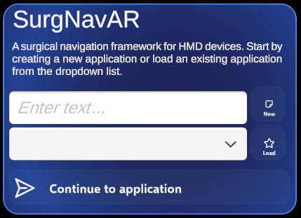
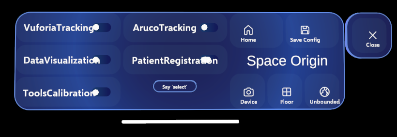
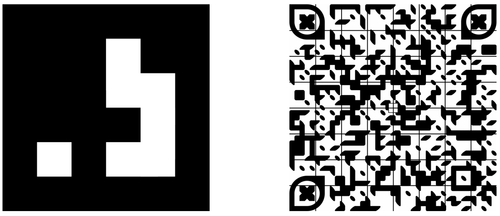
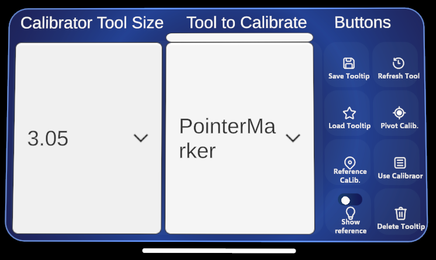
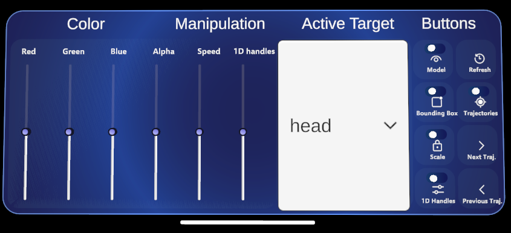
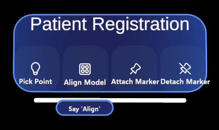

# 🩺 SurgNavAR – User Guide

> This guide explains how to install, configure, and use the AR Surgical Navigation Framework on the supported HMD device.
> For developer setup and contribution, see [Developer Guide](./DeveloperGuide.md).

---

## 📦 Installation

### 🕶 Supported Devices

* **Microsoft HoloLens 2**
* **Magic Leap 2**

### 🧰 Prerequisites

* Access to a compatible headset (paired with a PC)
* Wi-Fi or USB connection for app deployment

---

## 🚀 Quick Start

### Step 1: Download and Install

* **Microsoft HoloLens 2:**
1. download the `.appxbundle` file: [HL2 v0.1.0](https://github.com/abdullahthabit/SurgNavAR/releases/download/0.1.0/SurgNavAR_0.1.0.0_arm64.appxbundle)
2. Connect your HL2 device to the device portal, [see documentation](https://learn.microsoft.com/en-us/windows/mixed-reality/develop/advanced-concepts/using-the-windows-device-portal).
3. In the device portal, navigate to the download folder in the File explorer tab. 
4. Click upload a file to this directory, and uploaded the downloaded HL2 `.appxbundle` file.
5. In your HL2 device, navigate to the download folder and click on the copied `.appxbundle` file to install it.

* **Magic Leap 2**
1. download the `.apk` file: [ML2 v0.1.0](https://github.com/abdullahthabit/SurgNavAR/releases/download/0.1.0/SurgNavAR_0.1.0.0.apk)
2. Connect your ML2 device to the magic leap hub, [see documentation](https://developer-docs.magicleap.cloud/docs/guides/developer-tools/ml-hub-3/get-started/).
3. In the magic leap hub, navigate to the download folder in the File tab and copy (drag) the `.apk` file to the folder.
4. In your ML2 device, navigate to the download folder and click on the `.apk` file to install it

### Step 2: Launch the Application

1. Locate **SurgNavAR** in your device app list.
2. Launch the app.
3. Allow permissions for camera, microphone and spatial mapping (first launch only).
4. bring up your left/right hand infront of you, so the welcome menu shows up.
5. (a) **First time:** Create a new surgical application:
    - Type the application name (only HL2)
    - click on the button `New` to setup the application.
5. (b) if you already have an application, choose it from the dropdown list and click on `Load`.
6. Click on `Contine to application` to start the application. 

  

---

### Step 3: Work with the navigation application

* Once inside the application, bring up your left hand to view the main control menu:

  

* The menu controls the following functionalities:

| Button             | Function                                                      |
| ------------------- | ------------------------------------------------------------- |
| **Vuforia tracking**  | Start marker tracking using Vuforia |
| **Aruco tracking**     | Start marker tracking using ArUco |
| **Data Visualization**    | Show the patient-specific 3D models |
| **Patient Registration**    | Use Point-based matching for registration with the patient|
| **Tool Calibration** | Calibrte surgical tools (i.e., locate the tooltip position and orientation) |
| **Home** | Returns to the welcome menu to select a different surgical application |
| **Save Config** | Save any changes made to the config file during the application |
| **Space Origin (Device)** | Set the application XR origin to the device |
| **Space Origin (Floor)** | Set the application XR origin to the Floor |
| **Space Origin (Unbounded)** | Set the application XR origin to unbounded |

---

## 🧩 Marker Tracking

* Requires printed **Vuforia Image Targets** or **ArUco binary markers**.

  

1. Print the target markers (see the files in Demo application)
2. Make sure they are flat on the surface they are attached to.
3. activate one of the tracking modes (change the XR origin to device for Vuforia and to floor for ArUco)
4. Successful tracking should show a green outline around the target marker.

---

## ⚙️ Tool Calibration

1. Attach a Vuforia/ArUco marker to the target surgical instrument.
2. Make sure Vuforia/ArUco tracking is active.
2. Toggle the `ToolsCalibration` button on the main control menu. 
3. Bring up your right hand to show the tools calibration menu.
4. The menu does the following functionalities:

  

| Button             | Function                                                      |
| ------------------- | ------------------------------------------------------------- |
| **Calibrator Tool Size**  | A dropdown menu to choose the diameter of the tool to be calibrated (only for calibrator method) |
| **Tool to calibrate**     | A dropdown menu to choose which tool you want to calibrate |
| **Save Tooltip**    | After calibrating a tool, update its tip position and orientation in the config file to be loaded later |
| **Refresh Tool**    | Update the list of tools to calibrate (e.g., after switching the tracking mode between Vuforia/ArUco)|
| **Load Tooltip** | Load the saved tooltip pose from the config file |
| **Pivot Calib.** | Run pivot calibration. This will collect marker poses while pivoting and after a few seconds calculate the tooltip position |
| **Reference Calib.** | Run reference (visual calibration) with the assistance of the user. Requires `Reference Cylinder` to be toggled |
| **Use Calibrator** | Run calibration with the assistance of the calibrator. Requires the `Calibrator tool size` to be selected |
| **Show Reference** | Shows a cylinder for reference visual calibration |
| **Delete Tooltip** | Remove the current tooltip (e.g., to redo it again) |

* upon successful ccalibraiton a visual represntation of the tool (sphere (pivot calibration), and cylinder (refernce and calibrator methods) will be shown).

---

## 🧍 Patient Model Visualization

* Load 3D patient models (OBJ files) from the app’s data folder.
* Models can be scaled, rotated, or translated via on-screen controls.
* Toggle model visibility from the **data visualization control menu**.

1. toggle the `DataVisualization` button on the main control menu to load the patient models and activate the patient control menu.
2. The menu does the following functionalities:

  

| Button             | Function                                                      |
| ------------------- | ------------------------------------------------------------- |
| **Color Sliders**  | Controls the appearance of the active target model |
| **Manipulation Slider (Speed)**     | Controls the speed of model movement with manual manipulation |
| **Manipulation Slider (1 handles)**    | Control the size of the 1 DOF handles. Requires the `1D handles` toggle to be on |
| **Active target**    | A dropdown list with all patient target structures to select which to control |
| **Model toggle** | Show and hide active target |
| **Refresh** | Reset the model to its initial scale and re-position it to be infront of the user. |
| **Bounding Box toggle** | Activate and deactivate manual manipulation of the patient models |
| **Trajectories toggle** | Show and hide planned trajectories |
| **Scale toggle** | Lock and unlock model scaling |
| **1D Handles toggle** | Switch between 6 DOF and 1DOF manual manipulation with axes handles |
| **Next/Previous Traj.** | Switch between planned trajectories |

---

## 🧭 Image-to-Patient Registration

### Options:

* Aligns the preoperative models with the patient.
* Two options are available in the framework:
    - **Point-based matching**: annotate points on the preopeartive image and match them with their counterparts on the patient.
    - **Manual placement**: manipulate the models and visually align them with the patient.

1. Toggle the `PatientRegistration` button.
2. Bring up you right hand to show the registration control menu.
3. The menu allow the following functionalities:

  

| Button             | Function                                                      |
| ------------------- | ------------------------------------------------------------- |
| **Pick Point**  | Collects a point for point-based matching. Requires marker tracking and tools calibration |
| **Align Model**     | After collecting all needed points for point-based matching, aligns the model with the patient. |
| **Attach Marker**    | Used with manual placement, after manually aligning the model, attach its pose to the patient marker for real-time patient pose updates |
| **Detach Marker**    | Detach the model from the patient marker |
---

## 🗺 Navigation Mode

* Once registration is complete, navigation starts automatically with the overlay of:

  * Patient target structures
  * Virtual representaiton of the planned trajectories
  * Distance disply for numeric feedback

---

## 🧾 Closing the navigaiton session

* To stop navigation, turn off the tracking from the tracking toggle button.
* Save Config file if you made any changes that you want to preserve for next time (e.g., model colors)
* If you want to open a session for another surgical application return to the welcome menu and chose a different application or create a new one.

---